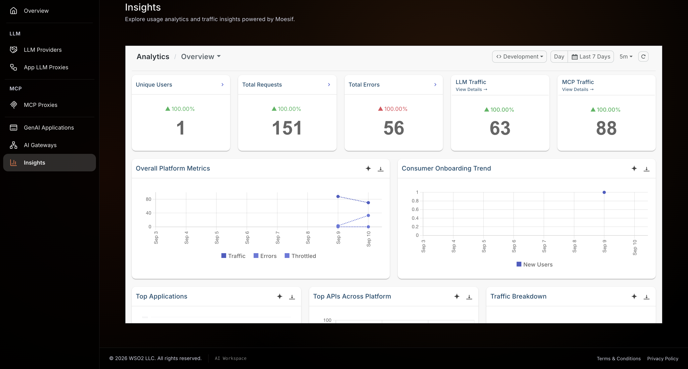

# Observe AI gateway traffic: Tokens, cost, latency, and traces

## Overview

A large language model (LLM) proxy raises questions that ordinary API monitoring can't answer. A chart of request counts tells you nothing about which model spent your token budget, what a conversation cost, or which guardrail rejected a prompt. The WSO2 AI Gateway records those AI-specific signals alongside the usual traffic signals, so one gateway answers both.

This guide shows you which signals the AI Gateway records, how to turn each one on, and how to read it. You start in the API Platform console with token usage and cost, then move to per-request logs, and finish with the gateway's own metrics and traces. A companion sample runs the whole stack locally, with a mock model, so you can see live charts without a provider account.

This guide is for developers and platform administrators who operate an LLM proxy and need to answer questions about its traffic.

## Learning objectives

- Identify which observability signal answers which question about AI traffic
- Read token consumption, estimated cost, and guardrail interventions per model and per consumer in the console
- Trace a single failed request from a chart to its log entry using the gateway response code
- Turn on the gateway's Prometheus metrics and OpenTelemetry tracing, and read the AI Gateway Overview dashboard

## Prerequisites

- A WSO2 API Platform account. [Sign up for free](https://console.bijira.dev).
- An LLM proxy deployed to an AI gateway that shows **Active** in the console. To create one, follow [Enforce token-based rate limiting on an LLM proxy](enforce-token-based-rate-limiting-on-an-llm-proxy.md).
- An API key and the invoke URL for that proxy
- `curl` for sending test traffic

## Key concepts

Observability data falls into three kinds, called *signals*. Each signal answers a different question, and none of them substitutes for the others.

| Signal | Answers | Recorded by |
|---|---|---|
| **Analytics** | How much did callers consume over a period, and what did it cost? | The gateway publishes an event per request to an analytics backend. |
| **Metrics** | How much traffic, how fast, and how often did it fail? | The gateway components expose counters and timings that a collector reads on a schedule. |
| **Traces and logs** | What happened to this one request, and where did its time go? | The gateway records a span per hop and a log line per request. |

The following terms appear throughout this guide:

- **Moesif** — the API analytics platform behind the console's **Insights** page. The gateway publishes one analytics event per request to it.
- **Prometheus** — a metrics collector that reads, or scrapes, numeric values from an endpoint every few seconds and stores them over time.
- **Grafana** — a dashboard tool that charts the values Prometheus stored.
- **OpenTelemetry (OTel)** — the vendor-neutral standard the gateway uses to emit traces. An OTel collector receives them and forwards them to a tracing backend.
- **Jaeger** — the tracing backend that stores traces and displays them as a timeline.
- **Trace** — the record of one request's whole journey. A **span** is one step inside a trace, such as a policy running or a call to the model.
- **p50 and p95** — the typical and the slow-tail response times. A p95 of 800 milliseconds means 95 percent of requests finished faster than that.

## What you can observe

The AI-specific signals come from the analytics events the gateway publishes, and you read them on the **Insights** page. This is the layer that makes an LLM proxy measurable in the terms you budget in.

| What you see | Why it matters |
|---|---|
| Prompt, completion, and total tokens | Tokens are the unit LLM providers bill in, so this is your consumption in real terms. |
| Estimated LLM cost | Turns token counts into a spend figure per model, so you can attribute cost before the invoice arrives. |
| Token usage by model and provider | Shows whether traffic landed on the model you intended, which matters when a proxy distributes across several. |
| Guardrail interventions | Counts the prompts and responses a guardrail rejected, reported as `HTTP 422`. Confirms a guardrail behaves as configured. |
| Rate limit rejections | Counts requests refused once a token budget was reached, reported as `HTTP 429`. |
| Per-application and per-consumer breakdowns | Attributes tokens and cost to a mapped GenAI application, so one team's spend is separable from another's. |

The operational signals come from the gateway's own Prometheus metrics. These answer how the gateway itself is behaving, independent of what the model returned.

| Metric | What it tells you |
|---|---|
| `policy_engine_requests_total` | Request rate, labeled by `route`, `api_name`, and `api_version`, so you get traffic per proxy. |
| `policy_engine_request_duration_seconds` | How long the gateway itself took, separate from the model's own response time. |
| `policy_engine_short_circuits_total` | Requests the gateway blocked before they reached the model, labeled by `policy_name`. This names the guardrail or rate limit that blocked them. |
| `policy_engine_request_errors_total` | Faults inside the gateway's request processing. |
| `envoy_http_downstream_rq_time_bucket` | End-to-end response time, including the model, as a histogram you can read p50 and p95 from. |
| `envoy_http_downstream_rq_xx` | Response counts by status class, so `2xx` successes separate from `4xx` rejections and `5xx` failures. |
| `envoy_cluster_upstream_rq_xx` | Failures the model backend itself returned, separating a provider outage from a gateway fault. |

!!! note
    Token counts and cost are not Prometheus metrics. They travel in analytics events instead, because a token count belongs to one request and one model rather than to a numeric series the gateway keeps adding to. Read tokens and cost on **Insights**, and traffic, latency, and errors in metrics.

For every metric the gateway components expose, see the [metric reference](../../api-gateway/1.2.0/observability/metrics/metric-reference.md).

## Architecture

```
Your application
    |  HTTPS + API key
    v
+-----------------------------------------------+
|  WSO2 AI Gateway                              |
|  [ LLM Proxy ]  auth · guardrails · limits    |
+-----------------------------------------------+
    |                  |                |
    |  analytics       |  metrics       |  traces (OpenTelemetry)
    |  event/request   |  endpoint      |
    v                  v                v
Insights           Prometheus       OTel collector
(console)              |                |
                       v                v
                   Grafana           Jaeger
```

The gateway emits all three signals from the same request, without adding to the response time your callers see. The gateway batches analytics events and publishes them after the response returns. Metrics sit on an endpoint the collector reads on its own schedule. The gateway exports traces in the background.

## Step 1: Open Insights in the console

**Insights** is where the AI-specific signals appear.

1. Sign in to the [WSO2 AI Workspace](https://ai-workspace.bijira.dev/).
2. Open the project holding your LLM proxy.
3. In the left navigation menu, click **Insights**.

**Expected result:** The Insights page opens with an overview panel showing **Total Requests**, **Avg Latency**, and **Success Rate**.

!!! note
    A gateway you run yourself publishes analytics only when its runtime holds a Moesif application ID. Set `MOESIF_KEY` in `api-platform.env`, the environment file the gateway loads, then restart the runtime. Without that key the gateway publishes nothing and Insights stays empty. See [Moesif analytics](../../ai-gateway/1.2.0/analytics/moesif-analytics.md) for the full configuration.

## Step 2: Send a mix of traffic through the proxy

An empty dashboard tells you nothing. Send a handful of requests, including some that fail, so every panel has data.

1. Send three successful requests, changing the question each time:

    ```bash
    curl -k -X POST https://<PROXY-INVOKE-URL>/chat/completions \
      -H "X-API-Key: <YOUR-API-KEY>" \
      -H "Content-Type: application/json" \
      -d '{
        "model": "gpt-4o-mini",
        "messages": [{"role": "user", "content": "What is the capital of France?"}]
      }'
    ```

    **Expected result:** `HTTP 200` with a model response.

2. Send one request without an API key, to produce an authentication failure:

    ```bash
    curl -k -X POST https://<PROXY-INVOKE-URL>/chat/completions \
      -H "Content-Type: application/json" \
      -d '{
        "model": "gpt-4o-mini",
        "messages": [{"role": "user", "content": "Hello"}]
      }'
    ```

    **Expected result:** `HTTP 401 Unauthorized`.

3. Send one request naming a model the provider doesn't serve, to produce an upstream error:

    ```bash
    curl -k -X POST https://<PROXY-INVOKE-URL>/chat/completions \
      -H "X-API-Key: <YOUR-API-KEY>" \
      -H "Content-Type: application/json" \
      -d '{
        "model": "no-such-model",
        "messages": [{"role": "user", "content": "Hello"}]
      }'
    ```

    **Expected result:** The gateway passes back a `4xx` or `5xx` response from the provider.

!!! note
    Allow up to two minutes for this traffic to appear in **Insights**. The gateway publishes analytics events in batches, so a chart that looks empty right after a request often fills in shortly after.

## Step 3: Read token usage and cost in Insights

With traffic recorded, work down the page from the summary to the detail.

1. Read the overview panel. **Total Requests** should match the requests you sent, and **Success Rate** should reflect the two failures.
2. Open **Request Trend** to see request volume over time. Use this to spot a traffic spike, or to confirm that a configuration change moved volume the way you expected.
3. Open **Traffic Split** to see how volume divided across your proxies and providers. On a proxy that distributes across several models, this is where you confirm the distribution matches the policy you configured.
4. Open the token usage view to see prompt, completion, and total tokens. Compare the prompt count against the completion count. A large completion count against a small prompt count means the models produce long answers, which is the cost driver worth knowing about before you set a budget.
5. Open the cost view to see estimated spend per model, derived from those token counts and the model's price.

The Insights overview panel and request trend chart appear as follows:

{.cInlineImage-full}

Token consumption broken down by model appears as follows:

{.cInlineImage-full}

!!! tip
    Map your client applications to [GenAI applications](../../cloud/ai-workspace/genai-applications.md) before you need the numbers. Once mapped, Insights attributes tokens and cost per application, which turns a single total into a per-team figure you can act on.

## Step 4: Find a single request in the console logs

A chart tells you that requests failed. The logs tell you which request, and why. Runtime logs sit in the API Platform console rather than in the AI Workspace, so this step changes surface.

1. In the API Platform console, click **Observability** in the left navigation menu, then click **Logs**.
2. Set the time range to cover the traffic you sent in Step 2.
3. Read the `gatewayCode` field on each gateway log entry. It states what the gateway did with the request:

    | `gatewayCode` | Meaning |
    |---|---|
    | `BACKEND_RESPONSE` | The gateway processed the request and returned the model's response. |
    | `AUTH_FAILURE` | The gateway rejected the request over authentication, such as a missing or invalid API key. |
    | `RATE_LIMITED` | The gateway refused the request because a rate limit was reached. |
    | `NO_HEALTHY_BACKEND` | The gateway found no reachable backend for the request. |

4. Find the entry for the unauthenticated request from Step 2. Its `gatewayCode` reads `AUTH_FAILURE`.
5. Read the `Duration` field on a successful entry to see how long the gateway took to serve it, and copy the `CorrelationID`. That identifier follows one request through the log, so you can use it to find every entry belonging to the same call.

The Logs page with a gateway log entry expanded appears as follows:

{.cInlineImage-full}

!!! tip
    Search the log with a regular expression to narrow a large result set. For example, `.*(GET|POST).*&.*500.*` finds requests that returned `HTTP 500`. See [Runtime logs](../../cloud/monitoring-and-insights/logs/runtime-logs.md) for the full search syntax.

## Step 5: Turn on gateway metrics and open the dashboard

Metrics live on the gateway runtime rather than in the console, so a gateway you run yourself needs two settings switched on. If you use a gateway hosted for you, skip this step.

1. Open `configs/config.toml` in the gateway distribution.
2. Add the metrics endpoints for the two components that expose them:

    ```toml
    [controller.metrics]
    enabled = true
    port = 9091

    [policy_engine.metrics]
    enabled = true
    port = 9003
    ```

3. Start the gateway with the metrics services included:

    ```bash
    docker compose --profile metrics up -d
    ```

4. Confirm each endpoint responds. The router exposes its metrics through the Envoy admin port rather than a configured one:

    ```bash
    curl -s -o /dev/null -w "%{http_code}\n" http://localhost:9091/metrics
    curl -s -o /dev/null -w "%{http_code}\n" http://localhost:9003/metrics
    curl -s -o /dev/null -w "%{http_code}\n" http://localhost:9901/stats/prometheus
    ```

    **Expected result:** `200` from all three.

5. Open Grafana at `http://localhost:3000` and open the **AI Gateway Overview** dashboard.

The dashboard charts the operational signals from the table earlier in this guide: request rate per proxy, gateway processing time as p50 and p95, end-to-end latency, responses by status class, policy rejections labeled by the policy that caused them, and upstream failures. Read them together rather than one at a time. Latency rising while the gateway's own processing time holds steady points at the model, not the gateway. Rejections climbing on one policy name points at that policy's configuration.

The AI Gateway Overview dashboard appears as follows:

{.cInlineImage-full}

!!! warning
    The Grafana image in the distribution's `docker-compose.yaml` is left empty for licensing reasons. Set a valid image tag, such as `grafana/grafana:11.6.0`, on the `grafana` service before you start the metrics services. See [Enable metrics](../../api-gateway/1.2.0/observability/metrics/enabling-metrics.md).

## Step 6: Follow one request across hops with tracing

Metrics aggregate every request. A trace shows one, hop by hop, which is what you need when a single call is slow and the averages look fine.

1. Add the tracing configuration to `configs/config.toml`, pointing it at your OTel collector:

    ```toml
    [tracing]
    enabled = true
    endpoint = "otel-collector:4317"
    sampling_rate = 1.0
    ```

2. Start the gateway with the tracing services included:

    ```bash
    docker compose --profile tracing up -d
    ```

3. Send another request through the proxy, so there's a fresh trace to open.
4. Open Jaeger at `http://localhost:16686`.
5. Select the `router` service, then click **Find Traces**.
6. Open a trace and read the timeline. Each span is one step, and the width of its bar is the time that step took. A span that fills most of the trace is where the request spent its time.

A trace timeline for a single request appears as follows:

{.cInlineImage-full}

!!! tip
    Set a **Min Duration** filter in Jaeger, such as `1000ms`, to list only the slow requests. Filtering by the tag `error=true` lists only the failures.

!!! note
    A sampling rate of `1.0` records every request, which suits a test environment. On a busy gateway, record a fraction instead, such as `0.1` for one request in ten, and raise it when you're investigating. See [Tracing](../../ai-gateway/1.2.0/logging-and-tracing/tracing.md) for sampling guidance.

## Verify

Work through these checks to confirm all three signals reach you.

1. On **Insights**, confirm the request count matches the traffic you sent, and that a token figure appears against the model you called.
2. On **Insights**, confirm the two deliberate failures from Step 2 lowered the success rate.
3. On the **Logs** page, find the unauthenticated request and confirm its `gatewayCode` reads `AUTH_FAILURE`.
4. In Grafana, confirm the request rate panel names your proxy and that the responses panel shows both a `2xx` and a `4xx` series.
5. In Jaeger, open one trace and confirm it contains more than one span.

## Troubleshooting

| Symptom | Resolution |
|---|---|
| Insights shows no data | Confirm the gateway runtime holds a Moesif application ID. On a gateway you run yourself, check that `MOESIF_KEY` is set in `api-platform.env` and restart the runtime. |
| Insights lags behind your requests | The gateway publishes analytics events in batches. Allow up to two minutes, then reload the page. |
| Token counts appear but cost doesn't | Cost is estimated from the model's price. Confirm the model name in your request matches one the pricing data covers. |
| A metrics endpoint returns a connection error | Confirm `enabled = true` under both `[controller.metrics]` and `[policy_engine.metrics]`, then restart the gateway components. |
| Grafana loads but every panel reads `No data` | Confirm Prometheus is scraping all three endpoints. Open the Prometheus targets page and check each target reports as up. |
| Grafana container fails to start | The distribution ships the `grafana` service with an empty image field. Set a valid image tag on it. |
| Jaeger lists no traces | Confirm the OTel collector container is running and that `endpoint` in `[tracing]` names it. Check the collector's logs for export failures. |
| Traces stop after a restart | Jaeger holds traces in memory by default, so a restart discards them. Configure a storage backend to keep them. |

## What you learned

- Matched each observability signal to the question it answers: analytics for consumption and cost, metrics for traffic and latency, traces and logs for one request
- Read token counts, estimated cost, and per-model breakdowns on the console's **Insights** page, and learned why those figures live in analytics rather than in metrics
- Moved from an error on a chart to the log entry behind it using `gatewayCode` and `CorrelationID`
- Turned on the gateway's Prometheus metrics and OpenTelemetry tracing, and read the AI Gateway Overview dashboard and a trace timeline

## Next steps

- [Enforce token-based rate limiting on an LLM proxy](enforce-token-based-rate-limiting-on-an-llm-proxy.md) — act on the token figures from Insights by capping consumption per window
- [Set up a governed multi-model LLM proxy with cost controls and failover](set-up-a-governed-multi-model-llm-proxy-with-cost-controls-and-failover.md) — distribute traffic across models, then use Traffic Split to confirm the distribution
- [Guardrails overview](../../cloud/ai-workspace/policies/guardrails/overview.md) — add guardrails, then track their interventions as `HTTP 422` responses
- [Metric reference](../../api-gateway/1.2.0/observability/metrics/metric-reference.md) — every metric the gateway components expose, with labels
- [Moesif analytics](../../ai-gateway/1.2.0/analytics/moesif-analytics.md) — configure the analytics publisher and control which headers leave the gateway

## Try the sample

The companion sample runs the AI Gateway with its full observability stack against a mock model, so no provider account or API key is required. It starts Prometheus, Grafana, an OpenTelemetry collector, and Jaeger, registers two LLM proxies, generates a minute of mixed traffic, and provisions the AI Gateway Overview dashboard, so you get live charts and traces from one command.

[View the sample on GitHub](https://github.com/wso2/api-platform/tree/main/samples/ai-gateway-observability)
