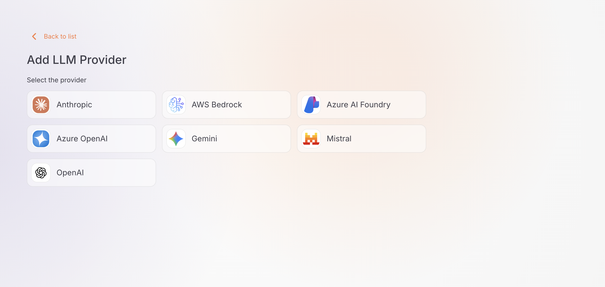
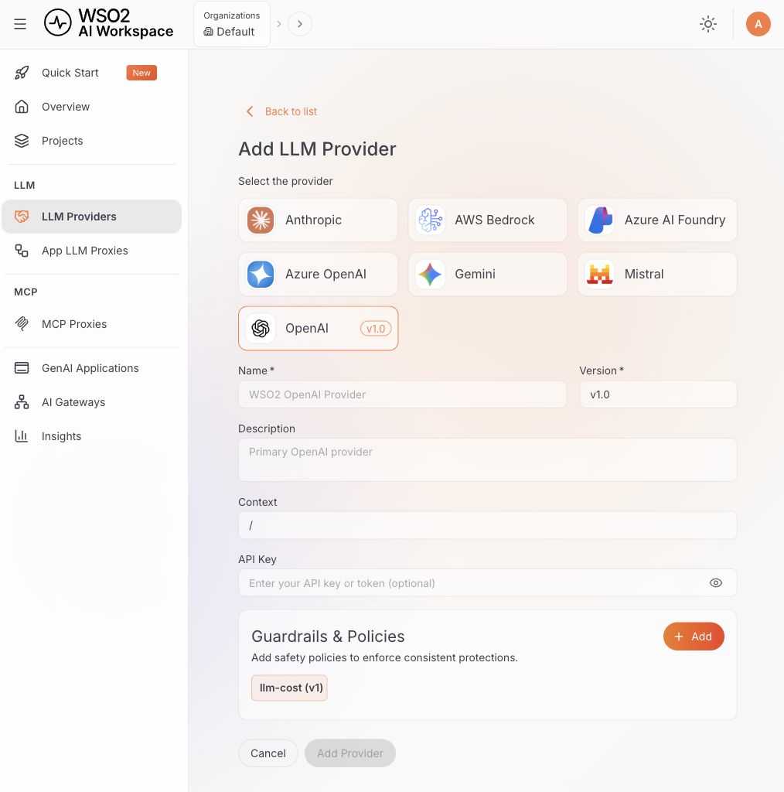

# Configure LLM Provider

LLM providers allow you to connect AI service platforms like OpenAI, Anthropic, and others to the AI Workspace. Once configured, providers can be deployed and used directly through the managed gateway.

!!! note
    App LLM proxies are optional. Use one when you want app-specific or agent-specific guardrails, authentication, or resource exposure on top of the same provider.

## Prerequisites

- A user whose token carries the scopes these steps need: `ap:llm_provider:manage` to add and edit providers, `ap:llm_provider:deployment:manage` to deploy one, `ap:gateway:read` to choose the target gateway, and `ap:secret:create` because AI Workspace stores the upstream API key as an encrypted [secret](../secrets-management.md) on your behalf. Of the roles the [role-to-scope mapping](../authentication/overview.md) ships, `ap_admin` grants all four. `ap_publisher` grants every one except `ap:secret:create`, so saving a provider with a new API key is rejected until you add that scope to the role.
- At least one [AI Gateway created and set up](../ai-gateways/setting-up.md)
- API credentials for your LLM provider, such as an API key or an access token

## Add a New Provider

1. Navigate to **AI Workspace** in your API Platform dashboard.
2. Select **LLM Providers** from the menu.
3. Click **+ Add New Provider** and choose your provider type, for example **OpenAI** or **Anthropic**. Any [custom LLM provider templates](../llm-provider-templates/overview.md) you have created also appear in the picker.

   

4. If the selected template has more than one version, select a version and click **Continue**. A single version is selected automatically.

## Configure Provider Details

After selecting your provider type, fill in the provider configuration form:

   

### Basic Information

1. **Name** (required): Enter a unique name for the provider (for example, `openai-production`, `anthropic-dev`).

2. **Version** (required): The version is pre-filled (for example, `v1.0`). You can edit this if needed.

3. **Description** (Optional): Add a description to identify the provider's purpose.

4. **Context** (Optional): Enter the context path (default: `/`). This is the base context for the provider.

### Authentication

The authentication fields vary depending on the provider you selected:

=== "OpenAI"
    **API Key** (required): Enter your OpenAI API key (starts with `sk-proj-` or `sk-`).
    
    !!! info
        OpenAI's endpoint URL is pre-configured automatically.

=== "Anthropic"
    **API Key** (required): Enter your Anthropic API key (starts with `sk-ant-`).
    
    !!! info
        Anthropic's endpoint URL is pre-configured automatically.

=== "Gemini"
    **API Key** (required): Enter your Google AI API key.
    
    !!! info
        Gemini's endpoint URL is pre-configured automatically.

=== "Mistral AI"
    **API Key** (required): Enter your Mistral AI API key.
    
    !!! info
        Mistral AI's endpoint URL is pre-configured automatically.

=== "Azure OpenAI"
    1. **Upstream URL** (required): Enter your Azure OpenAI resource endpoint (for example, `https://your-resource.openai.azure.com/`).
    2. **API Key** (required): Enter your Azure OpenAI API key.

=== "Azure AI Foundry"
    1. **Upstream URL** (required): Enter your Azure AI Foundry endpoint URL.
    2. **API Key** (required): Enter your Azure AI Foundry API key.

=== "AWS Bedrock"
    1. **Upstream URL** (required): Enter the Bedrock runtime endpoint for your region, in the form `https://bedrock-runtime.<region>.amazonaws.com` (for example, `https://bedrock-runtime.us-east-1.amazonaws.com`).
    2. **API Key** (required): Enter your Amazon Bedrock API key. Paste the raw key — AI Workspace sends it as `Authorization: Bearer <key>` and adds the `Bearer ` prefix for you.

    !!! info
        Bedrock's endpoint isn't pre-configured, because the runtime host is region-specific. Use the region your API key and model access live in — a key issued in one region doesn't work against another region's endpoint.

!!! info "How the API key is stored"
    AI Workspace stores the upstream API key as an encrypted secret and keeps only a `{{ secret "handle" }}` reference in the provider configuration. The plaintext key never lands in the provider configuration or in an API response. See [Secrets Management](../secrets-management.md).

!!! note "Custom provider templates"
    If you're adding a provider from a custom [LLM provider template](overview.md#connecting-a-custom-provider) (**Settings > LLM Provider Templates**), the **Authentication Type** can also be set to **other** (no credentials stored — use a policy to handle upstream auth) or **none** (no upstream authentication sent), in addition to **api-key**.

### Add Guardrails (Optional)

You can attach policies and guardrails to your provider that apply to all requests:

1. In the **Guardrails** section of the form, click **+ Add Guardrail**.

2. A sidebar opens showing the available guardrails and policies.

3. Click a guardrail to select it and configure its settings.

4. Click **Add** to attach it to the provider.

!!! tip "Advanced settings"
    Each guardrail includes advanced configuration options that allow you to fine-tune its behavior. After selecting a guardrail, you can configure these settings before attaching it to the provider.

!!! info
    Learn more about available guardrails in the [Policies overview](../policies/overview.md). For the full list of policies and their specifications, visit the [Policy Hub](https://wso2.com/api-platform/policy-hub/).

## Save Provider

1. After configuring all settings and adding guardrails (if needed), click **Add Provider**.

2. A confirmation message reports that the provider was created.

3. The provider appears in the providers list.

## Deploy Provider to Gateway

After creating your provider, you must deploy it to a gateway before it can be used.

!!! warning "Required step"
    The provider isn't functional until you deploy it to at least one gateway.

1. Click the **Deploy to Gateway** button in the top right corner.

2. Click **Deploy** on one or more gateways from the available list.

3. Wait for the deployment to complete. The status changes to **Deployed**.

## Get Started

Once the provider is deployed, the provider details page shows the Invoke URL on the left and a **Get Started** panel on the right.

### Invoke URL

Select a gateway from the **Gateways** dropdown to see the base URL for accessing this provider through that gateway.

### API Keys

Generate an API key to authenticate requests to the deployed gateway.

1. Click **Generate API Key** in the Get Started panel.
2. Copy and save your API key immediately.

!!! danger "Important"
    An API key is displayed only once. Store it in a secure location immediately, because you can't retrieve it again.

### Deployed Gateways

The **Deployed Gateways** section lists all gateways this provider is deployed to, along with the host address and deployment status.

---

## Next Steps

- [Configure an App LLM proxy](../llm-proxies/configure-proxy.md): configure and deploy a specialized proxy endpoint for a GenAI application or agent that uses your provider
- [Manage an LLM provider](manage-provider.md): configure access control, security, rate limiting, and more