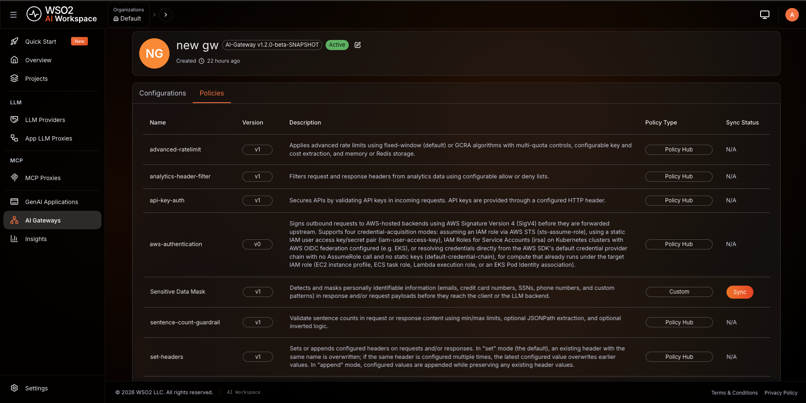
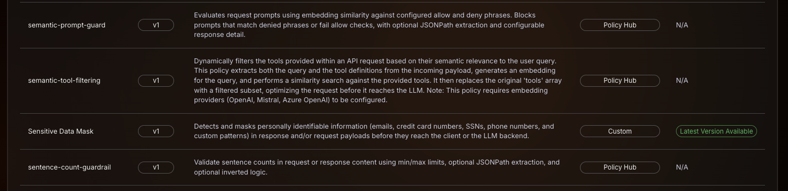
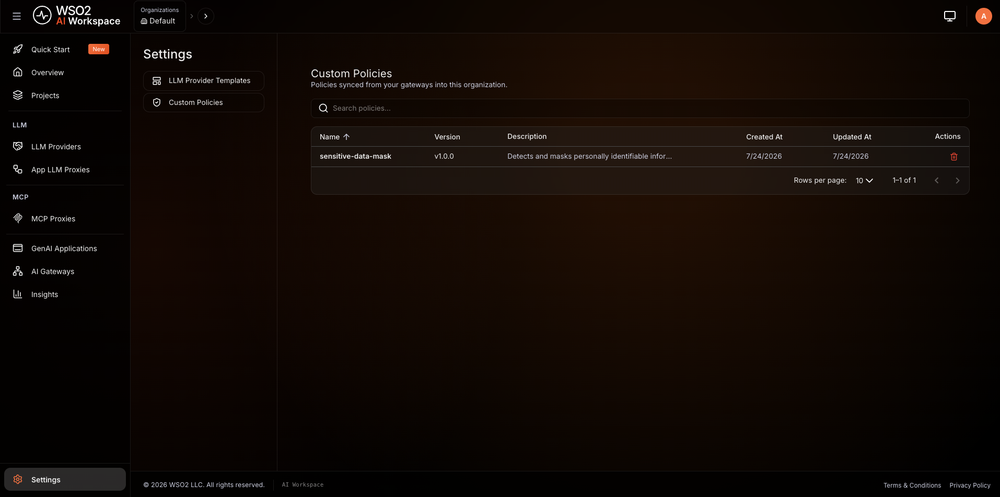
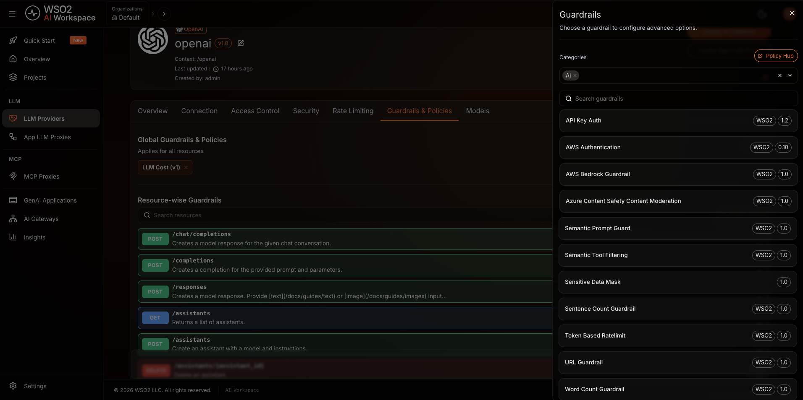

# Apply AI Policies to Proxies

After [building the AI Gateway with your custom AI policy](build-gateway-with-ai-policies.md) and starting it, the gateway automatically sends its policy manifest to the control plane on connection. You can then sync your custom AI policy to the organization and apply it to your LLM Providers, App LLM Proxies, and MCP Proxies.

## Step 1: View the Gateway Policies

1. Go to your AI Workspace.
2. From the left navigation, select **AI Gateways**.
3. Select your gateway to open the gateway detail view.
4. Click the **Policies** tab.

!!! note
    Each time the gateway connects to the control plane, it automatically sends an updated manifest with the latest policy details. The Policies tab always reflects the most recent manifest received.

The console fetches the manifest from the gateway and displays a table of all policies installed on it, with the following columns:

| Column | Description |
|---|---|
| **Name** | Policy name |
| **Version** | Installed version |
| **Description** | Policy description |
| **Policy Type** | `Policy Hub` for policy hub managed policies, `Custom` for your own AI policies |
| **Sync Status** | Whether the policy is synced to the organization — shows a **Sync** button when the policy is unsynced or a later version is available, or **Latest Version Available**/**N/A** if already up to date |

## Step 2: Sync the Custom AI Policy to the Organization

Custom AI policies must be synced to the organization before they can be applied to LLM Providers, App LLM Proxies, or MCP Proxies.

In the **Sync Status** column, each custom AI policy shows one of the following:

- **Sync button** — the policy is unsynced, or a later version is available. Click **Sync** to register it in the organization.
- **Latest Version Available** — the policy is already synced and up to date. No action needed.

!!! note
    Policy Hub policies (managed by WSO2) show **N/A** in the Sync Status column and cannot be synced manually.

Once synced, the custom AI policy is available organization-wide and can be applied to LLM Providers, App LLM Proxies, and MCP Proxies.

!!! note
    - Each major version of a custom AI policy is maintained as a separate policy entry with the same name.
    - A minor version update re-enables the Sync button, so you can sync the later version to the organization.
    - Patch version updates are not supported.
    - Version downgrades are not allowed.

## Step 3: View Organization-Level Custom Policies

After syncing, the custom AI policy appears in **Settings > Custom Policies**. To view it:

1. From the left navigation, select **Settings**.
2. Select **Custom Policies**.

This section lists all custom AI policies available in the organization with the following details:

| Column | Description |
|---|---|
| **Name** | Policy name |
| **Version** | Synced version |
| **Description** | Policy description |
| **Created At** | Date and time the policy was first synced |
| **Updated At** | Date and time the policy was last updated |

!!! note
    To delete a synced custom AI policy, none of the LLM Providers, App LLM Proxies, or MCP Proxies in the organization should be using it.

## Step 4: Apply the Custom AI Policy

Once synced, a custom AI policy is attached the same way for LLM Providers, App LLM Proxies, and MCP Proxies — it appears alongside the built-in guardrails and policies wherever policies are configured for that resource:

1. Navigate to **AI Workspace** and open the **LLM Providers**, **App LLM Proxies**, or **MCP Proxies** list, then click on the resource you want to configure.
2. Go to the **Guardrails & Policies** tab (MCP Proxies use a **Policies** tab).
3. Click **+ Add Guardrail** / **+ Add Policy** in the section for the scope you want:
    - **Global Guardrails**/**Global Policies** — applies to every endpoint or capability of the resource.
    - A specific endpoint or capability card (expand it first) — applies only there.
4. Select your custom AI policy from the sidebar — it's listed alongside the built-in policies — and configure its parameters.
5. Click **Add**/**Submit** to attach it, then deploy or redeploy the resource to the gateway to apply the changes.

For more detail on the global vs. per-resource scope referenced above, see [Policy Scope: Global vs. Per Resource](overview.md#policy-scope-global-or-per-resource).

## What's Next?

- [LLM Providers Overview](../llm-providers/overview.md): Learn about configuring LLM Providers
- [App LLM Proxies Overview](../llm-proxies/overview.md): Learn about configuring App LLM Proxies for Gen AI applications and agents
- [MCP Proxies Overview](../mcp-proxies/overview.md): Learn about configuring MCP Proxies
- [Policies overview](overview.md): Explore the built-in guardrails available alongside your custom AI policies
