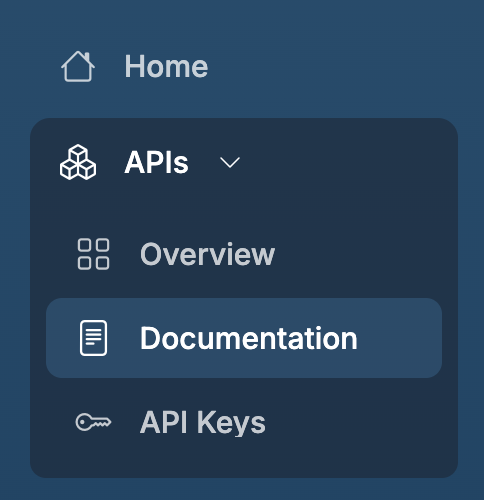
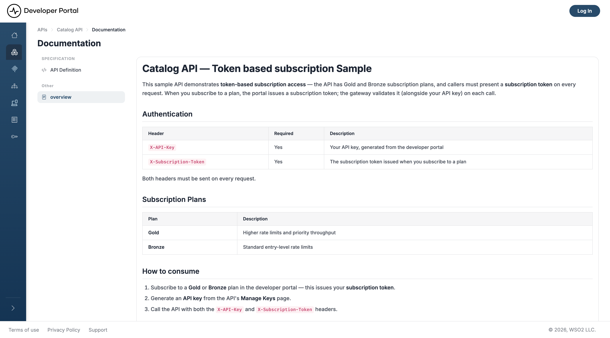

# API Documentation

The API documentation page provides essential information such as endpoints, schemas, security mechanisms, and the base URL.

## View API Documentation

1. Go to **APIs** in the sidebar.
2. Select an API to open its [overview page](api-overview.md).
3. Select **Documentation** under APIs or you can click the **documentation** button in the header section.

    {style="max-width:250px;"}

4. You can see the Documentations added to your API under different sections.
5. Select the documentation to view the content.

    

## Related

- [Search APIs](api-search.md): find the API you want to view
- [API Overview](api-overview.md): endpoints, resources, and subscription plans at a glance
